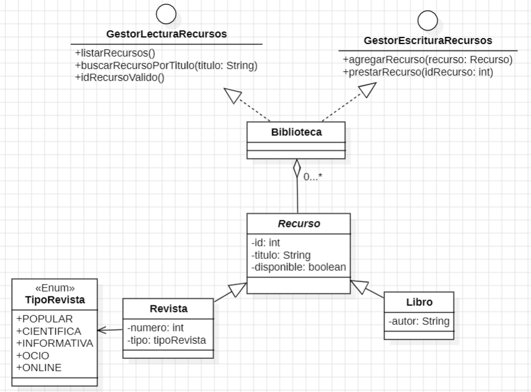

# BIBLIOTECA 

Se dieron los parametros para un sistema de Gestion para bibliotecas, en este se debian utilizar los principios de diseño **SOLID**.

De modo que se utilizo el principio de **SEGREGACION DE DEPENDENCIAS** para la manipulacion de recursos de la biblioteca usando las interfaces **GestorEscrituraRecursos** y **GestorLecturaRecursos**. Y se implementaron en la clase **Biblioteca**. 

Se utilizo Herencia para crear los recursos los cuales eran **Revista** y **Libro**.

Se puede observar en el siguiente diagrama UML.

